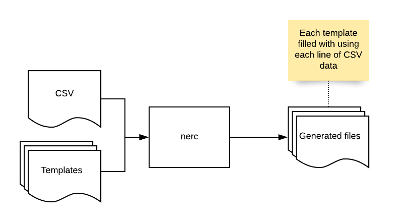

# NERC - nexrender configurer

Tool for filling nexrender config templates with CSV data.

**Note:** This is wery much work in progress...

## Idea of the tool



## Getting started...

1. Download `nerc` executable from [releases](https://github.com/Jeewes/nerc/releases)
2. Configure `nerc.yml`
3. Run `nerc`
    - Run `nerc -h` to see help
4. You should now have bunch of nexrender configs in a new `output` directory

## Configuring nerc.yml

An example of `nerc.yml` file:
```yaml
input: test_data/products.csv       # Defines the CSV input filepath
templates: test_data/templates/   # Defines the dirpath of the template files
variables:                          # Defines template variables
  - key: ProductName                # Defines the variable key or "name"
    csvSourceCol: 6                 # CSV column no for product name
  - key: ProductPrice               
    csvSourceCol: 14
    type: price                     # Type of the variable. Price is rendered with two decimals.
  - key: ProductImage
    csvSourceCol: 21
output: output/                     # Defines the output dirpath
runCommand: head -1 %s              # Command to be executed if -r flag is given.
```
`input:` Path to the input CSV file

`templates:` Path to the directory that contains the template files. Each template is used to generate
an output file per each line in the input CSV file. Templates can use variables defined in `nerc.yml` file
with `{{.<VariableKey>}}` syntax.

`output:` Output directory path for the generated config files.

`variables:` List of variables that can be used in the templates. Each variable must have `key` and `csvSourceCol`
which defines the CSV column number where the tools fetches the variable value. Optionally variable can also have
`type`. Currently only `price` type is supported, which tries to ensure two decimal price.

## Command line flags

`-r`: Use `nerc -r` to execute command using each generated config file as an input for the command. Define the
executed command in `nerc.yaml` with `runCommand` key e.g. `runCommand: head -1 %s` would call `head -1` command
for each generated config file and hence output the first line of each file. Note that the `%s` is substituted with
the template filename.

`-purge`: Cleans the output directory from all files. Everything inside the output directory specified in `nerc.yaml`
will be removed.

`-v`: Gives more verbose output.

### Attributions

Nerc Logo: <div>Icons made by <a href="https://www.flaticon.com/authors/freepik" title="Freepik">Freepik</a> from <a href="https://www.flaticon.com/" title="Flaticon">www.flaticon.com</a></div>